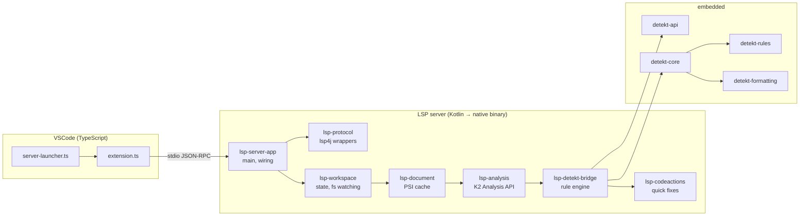
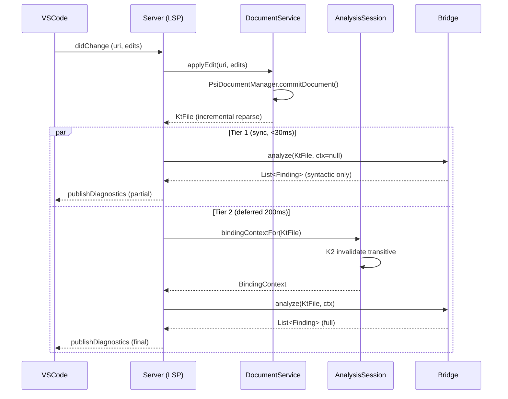

# Architecture

This is the technical companion to [the master plan](../../.claude/plans/staged-wishing-deer.md).
Read that first for context, performance targets, and milestone breakdown. This document focuses
on the *shape* of the system.

## Component diagram

## Module responsibilities

| Module | Responsibility | Depends on |
|---|---|---|
| `lsp-protocol` | lsp4j wrappers, type-safe request/response models, capability negotiation. | lsp4j |
| `lsp-workspace` | Workspace folders, file watching, config loading (`detekt.yml`, `baseline.xml`, plugin jars). | `lsp-protocol` |
| `lsp-document` | Live PSI cache. Maintains `Map<URI, VersionedKtFile>`. Applies `didChange` text edits to a shared IntelliJ `Document` and triggers incremental reparse. | `lsp-protocol`, `kotlin-compiler-embeddable` |
| `lsp-analysis` | `BindingContext` provider via K2 Analysis API. Per-file analysis sessions with transitive invalidation. | `lsp-document` |
| `lsp-detekt-bridge` | Adapter between detekt-api `Finding`s and LSP `Diagnostic`s. Two-tier dispatch: syntactic (sync) + type-resolution (deferred). | `lsp-analysis`, detekt-* |
| `lsp-codeactions` | LSP `CodeAction` resolution for fixable rules. Lazy resolve, per-finding. | `lsp-detekt-bridge` |
| `lsp-server-app` | `main()`, dependency wiring, GraalVM native-image config, applicationDefaultJvmArgs. | all of the above |
| `lsp-perf` | JMH benchmarks for the perf regression gate. | `lsp-document`, `lsp-detekt-bridge` |

## Data flow — `didChange` on a single line

## Key invariants

- **stdout is sacred.** All logs go to stderr or a configured file. Anything on stdout
  corrupts the JSON-RPC stream. (See `Main.kt`.)
- **One IntelliJ `Project` Disposable** for the whole server lifetime. PSI lives inside it.
- **PSI version monotonic per URI.** Old versions are dropped on `didChange`.
- **No allocation on the diagnostic hot path.** `Finding`/`Range` are pooled in M2+.
- **K2 Analysis API session ≠ KtFile.** Sessions are per-`use` block; cache the result.

## Distribution

Per-platform `.vsix` via `vsce publish --target`:

| Target | Binary | Size budget |
|---|---|---|
| `darwin-x64` / `darwin-arm64` | native (GraalVM) | <60 MB |
| `linux-x64` / `linux-arm64` | native (GraalVM) | <60 MB |
| `win32-x64` / `win32-arm64` | native (GraalVM) | <60 MB |
| (any) | fat-jar fallback | <50 MB |

JVM fallback path is always shipped in case GraalVM blocks on a particular platform.

## See also

- [docs/adr/0001-graalvm-native-image.md](adr/0001-graalvm-native-image.md) — why native image
- [docs/upstream-contribution.md](upstream-contribution.md) — long-term integration with detekt
